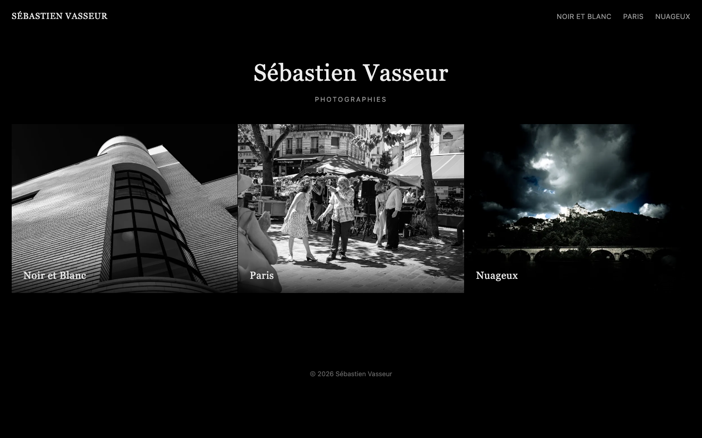

# Sébastien Vasseur — Photographies

Site portfolio photo personnel, construit avec [Astro](https://astro.build). Les photos sont organisées en chapitres (Noir et Blanc, Paris, Nuageux...), présentées dans une galerie avec transitions et une visionneuse plein écran.

Déployé automatiquement sur Cloudflare à chaque push sur `main` : https://bookphotos.sebastien-vasseur.workers.dev

## Ajouter un chapitre

1. Déposer les photos dans `src/content/chapters/<nom-du-chapitre>/`.
2. Créer `src/content/chapters/<nom-du-chapitre>.md` avec le frontmatter `title`, `order`, `description` et la liste `photos` (voir les fichiers existants comme exemple).

## Commandes

| Commande               | Action                                              |
| :---------------------- | :--------------------------------------------------- |
| `npm install`            | Installe les dépendances                              |
| `npm run dev`            | Lance le serveur de dev sur `localhost:4321`          |
| `npm run build`          | Build le site en production dans `./dist/`            |
| `npm run preview`        | Prévisualise le build en local                        |
| `npm run astro -- check` | Vérifie les types des fichiers `.astro`                |
